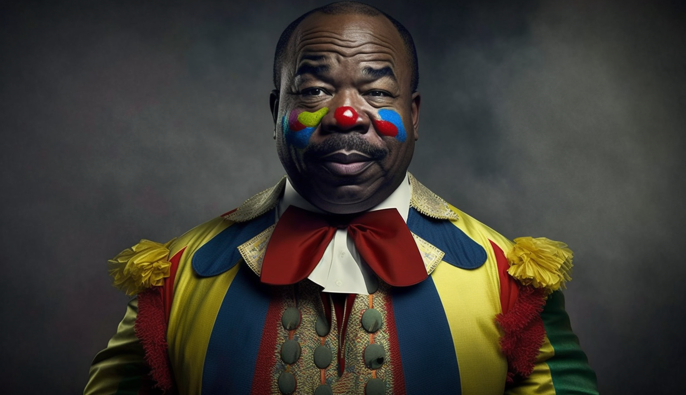

Welcome to [The African Journal][TAJ],

Ali Bongo, the French-controlled puppet and Emmanuel Macron's tiny lapdog, has finally been ousted as the President of Gabon, ending his 14-year rule over the country this Monday when the military junta staged a successful coup. It was the second attempt in under 5 years with the first occuring in 2019 where members of the Armed Forces of Gabon briefly took control of the country while the President was receiving medical treatment in Morrocco. The conspirators back then were ultimately unsuccessful, arrested, and jailed. 

As the son of [Omar Bongo](https://geo.esy.com/biographies/omar-bongo), his predecessor who ruled the country for 42 years, this deposition wraps up 56 years of what some term 'The Bongo Dynasty'.

Personally, I refer to them as 'The Bongo Crime Family' or 'The Bongo Cartel'. They're essentially gangsters, far from the characterization of a respectable and legendary 'dynasty' that brought power, prestige, and prosperity (PPP) to the Gabonese people. No. These are your typical, 'low down and dirty' hucksters, autocratic cronies masquerading as a democracy to loot the Gabonese people of their natural resources while serving the foreign interests of their puppeteers in Paris.

In that sense, sellouts like the Bongo family aren't even worth being compared to the Mafia, as at least the Italians had a sense of pride in their identity and culture. A non-Italian couldn't become a [made-man](https://en.wikipedia.org/wiki/Made_man), much less manipulate a member into betraying his own, yet leaders like Ali Bongo show no discomfort when it comes to betraying their people. Quite the contrast, actually; their lack of self-dignity and national pride makes them prime candidates for foreign puppet masters to easily hook their strings.

## Deposing Ali Bongo, the French Puppet

Sitting in a vintage-designed Western chair in Libreville on August 30th, a seemingly incoherent Ali Bongo released a video to the public, begging for support from his international counterparts and awkwardly asking them to 'make noise' – an explicit plea for help as the coup took place.

The astute among you will notice that nowhere in Bongo's pleas did he reach out to his loyal compatriots for help. That is, there was never any request for support from his own people—the very citizens who, if he were truly loved in his country, would be flocking to the streets in droves to free him.

You can see the video below:  

<iframe width="900" height="415" src="https://www.youtube.com/embed/hLf5cRGusu8?si=XFOtENLcS5cGeES7" title="YouTube video player" frameborder="0" allow="accelerometer; autoplay; clipboard-write; encrypted-media; gyroscope; picture-in-picture; web-share" allowfullscreen></iframe>

In 2019, Bongo reportedly experienced a stroke while visiting Saudi Arabia. Embarrassingly, he spent several months in the North African country of Morocco, seeking treatment for his ailments. This was necessitated by the fact that the country his family has governed for over 55 years lacks the necessary technological infrastructure to address his severe health conditions.

One might think that he could have negotiated with France for a few modern hospitals and clinics as a fair trade to support their strategic interests in the region. After all, 55 years of puppy-like loyalty and treason should come with a hefty price. Of course, if Bongo is like any other African crony who has kowtowed before Western elite, he and his family likely sold out for [pennies on the dollar](https://www.aa.com.tr/en/africa/luxurious-assets-of-gabons-bongo-family-in-france-under-the-scope/2980206#:~:text=The%20family's%20luxurious%20assets%20include,touristic%20city%20in%20Mediterranean%20France.).

<!-- ### Social Media Responses

Noted in multiple social media comments was the fact that Ali Bongo -->

<!-- 
It's like I told you, African leaders like Ali Bongo and his autocratic crime family don't live by a code of ethics nor do they have any sense of selfworth outside of what has been bestowed upon them. 

 (Discuss Bongo's ailments and unfortunate state after suffering a stroke in 2019 which has led him to his current inability to properly communicate for assistance. Discuss how his cousin took over due to claims that he is not well which is valid. Showcase the video Emmanuel Macron escorting him in Paris and make claims to how embarrassing that is. --- IF your foreign counterpart has to escort you up the stairs due to health ailments, its time to retire... also use blocquotes to reference Omar Bongos quote regarding France without Gabon and Gabon without France) - )

 "Gabon without France is like a car with no driver. France without Gabon is like a car with no fuel.." -->

<!-- ### Historical Context

The UN recognizes Gabons independence date as August 17th, 1960. 

That would mean that The Bongo Family, has ruled Gabon for approximately 90% of it's 63 years of independence and not a single nation in The West appears to have had an issue with the lack of democracy in this country. Could it be, because France has a strategic interest in the region?

(Add some metrics regarding wealth in Gabon and link to GPD article) -->

## Is the circus act over?

Early reports indicate that the leader of the military junta, [General Brice Oligui Nguema](https://www.bbc.com/news/world-africa-66666585), is Bongo's cousin. On the surface, it's unclear whether this is a dispute among family members aiming to maintain the status quo or a significant shift in the direction of Gabonese leadership. 

As the former head of the presidential guard, Nguema also played a crucial role in Omar Bongo's administration. Only time will tell, but for now, the Gabonese people continue to [celebrate](https://www.youtube.com/watch?v=n_jOm7yNKqk&ab_channel=VOAAfrica) the removal of Ali Bongo.
<!-- ### Who leads the military junta? -->

### International Response 

The African Union condemened and [suspended](https://www.democracynow.org/2023/9/1/headlines/au_suspends_gabon_after_coup_opposition_seeks_ballot_count_after_pre_coup_election_loss) Gabon
<!-- * The African Union: Suspends condemned and suspends Gabon from the AU
* United Nations: 
* France:
* United States:  -->

### Critical Reading Questions (CRQ)

1. Who is Omar Bongo? What is his relationship to Ali Bongo?
2. Explain the relationship between post colonial Gabon and France. Who has benefited the most?
3. Is Gabon a democracy?
4. Why has France maintained a healthy relationship with The Bongo Family despite 56 years of nepotism, disbanding of the multi-party system, and accusations of election fraud?

<!-- Notes
* Link to another journal or essay where we break down the Bongo families theft of the nations resources. Compare them to other leaders in the area that have stolen national wealth to buy houses and cars in the U.S and Europe. Show images of these homes and compare to images of the African homes in the countries these men led.
*  -->
 ### Sources
 * <ins>[ForeignPolicy - France's Concern for Gabons Democracy is Too Little, Too Late][FP]</ins>
 * <ins>[Aljazeera - World reaction to the military coup in Gabon ][Aljazeera]</ins>
 * <ins>[France24 - France condems Gabon coup as another African ally falls][France24]</ins>

## Disclaimer

The opinions and views expressed in this article are solely those of the author and do not necessarily reflect the official policy or position of esy.com. The content provided is for informational purposes only and should not be considered as professional advice. Readers are encouraged to do their own research and consult appropriate professionals for any decisions or actions they might take based on the information provided.

[TAJ]: https://www.esy.com/@africa
[France24]: https://www.france24.com/en/live-news/20230830-france-condemns-gabon-coup-as-another-african-ally-falls
[Aljazeera]: https://www.aljazeera.com/news/2023/8/30/world-reaction-to-the-military-coup-in-gabon
[FP]: https://foreignpolicy.com/2023/08/31/gabon-coup-military-africa-france-history-sahel-democracy/