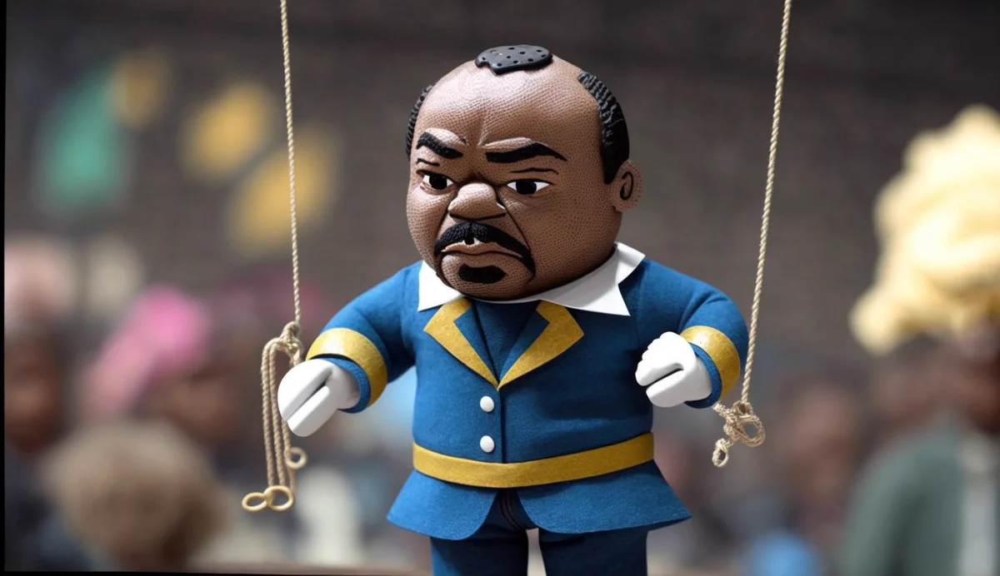
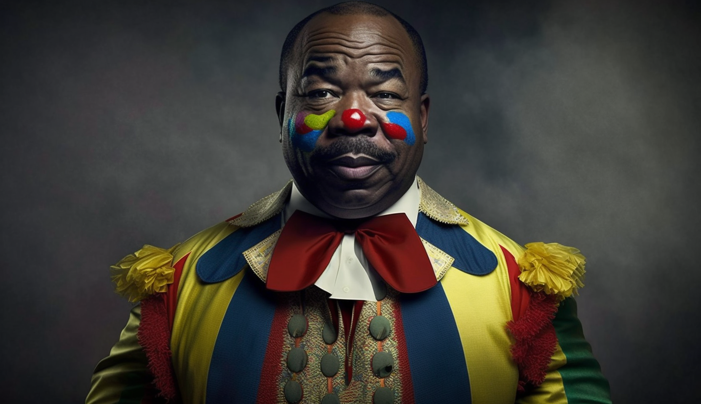

Welcome to [The African Journal][TAJ],

Ali Bongo, the French-controlled puppet and Emmanuel Macron's tiny lapdog, has finally been ousted as the President of Gabon, ending his 14-year rule over the country this Monday when the military junta staged a successful coup. As the son of Omar Bongo, his father and the former president of Gabon, who ruled the country for 42 years, his deposition wraps up 56 years of what some term 'The Bongo Dynasty'.

Personally, I refer to them as 'The Bongo Family' or a cartel. They are essentially gangsters, far from the characterization of a respectable and legendary 'dynasty' that brought power, prestige, and prosperity (PPP) to the Gabonese people. No. These are your typical hucksters, autocratic cronies maquerading as a democracy to loot the Gabonese people of their natural resources while serving the foreign interest of their former colonial master France.

In that sense, sellouts like the Bongo family aren't even worth being compared to the Mafia, as at least the Italians had a sense of pride in their identity and culture. A non-Italian couldn't become a made-man much less manipulate a member into betraying his own, yet leaders like Ali Bongo show no discomfort when it comes to betraying their people. Quite the contrast actually, their lack of self-dignity and national pride makes them prime candidates for foreign puppet masters to easily hook their strings. 

## Deposing Ali Bongo, the French Puppet

### Who leads the military junta?

### International Response

### Historical Context

The UN recognizes Gabons independence date as August 17th, 1960. 

That would mean that The Bongo Family, has ruled Gabon for approximately 90% of it's 63 years of independence and not a single nation in The West appears to have had an issue with the lack of democracy in this country. Could it be, because France has a strategic interest in the region?

(Add some metrics regarding wealth in Gabon and link to GPD article)

## Is the circus act over?

### Critical Reading Questions (CRQ)

1. Who is Omar Bongo? What is his relationship to Ali Bongo?
2. Explain the relationship between post colonial Gabon and France. Who has benefited the most?
3. Is Gabon a democracy?
4. Why has France maintained a healthy relationship with The Bongo Family despite 56 years of nepotism, disbanding of the multi-party system, and accusations of election fraud?

<!-- Notes
* Link to another journal or essay where we break down the Bongo families theft of the nations resources. Compare them to other leaders in the area that have stolen national wealth to buy houses and cars in the U.S and Europe. Show images of these homes and compare to images of the African homes in the countries these men led.
*  -->
 ### Sources
 * <ins>[ForeignPolicy - France's Concern for Gabons Democracy is Too Little, Too Late][FP]</ins>
 * <ins>[Aljazeera - World reaction to the military coup in Gabon ][Aljazeera]</ins>
 * <ins>[France24 - France condems Gabon coup as another African ally falls][France24]</ins>

## Disclaimer

The opinions and views expressed in this article are solely those of the author and do not necessarily reflect the official policy or position of esy.com. The content provided is for informational purposes only and should not be considered as professional advice. Readers are encouraged to do their own research and consult appropriate professionals for any decisions or actions they might take based on the information provided.

[TAJ]: https://www.esy.com/@africa
[France24]: https://www.france24.com/en/live-news/20230830-france-condemns-gabon-coup-as-another-african-ally-falls
[Aljazeera]: https://www.aljazeera.com/news/2023/8/30/world-reaction-to-the-military-coup-in-gabon
[FP]: https://foreignpolicy.com/2023/08/31/gabon-coup-military-africa-france-history-sahel-democracy/